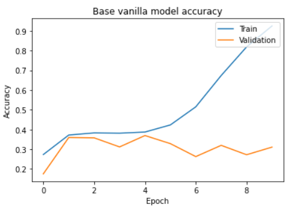
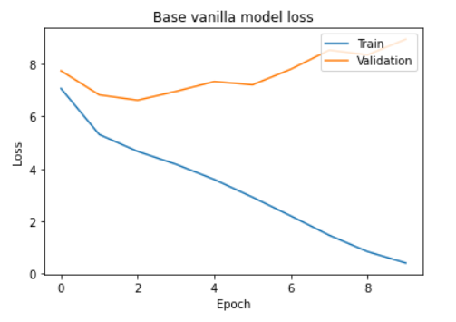
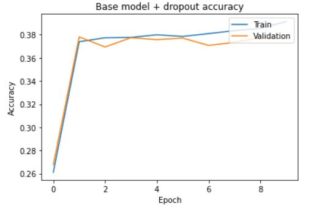
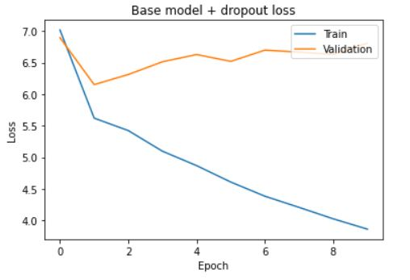
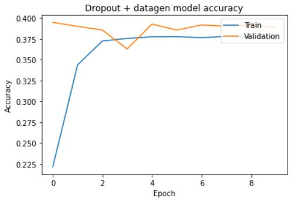
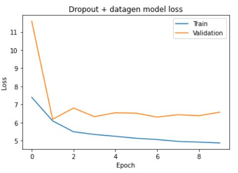
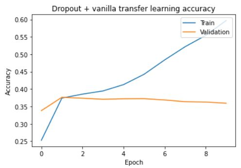
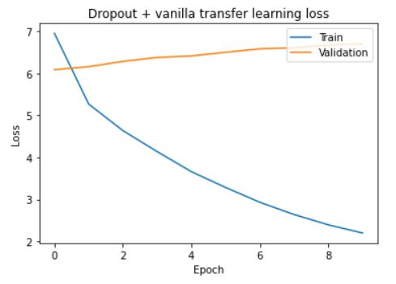
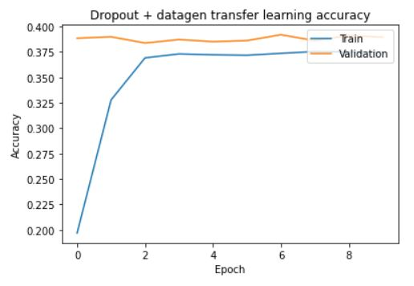
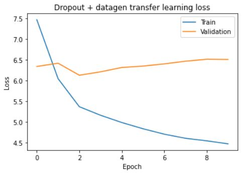

# deepLearningProject - Wiem CHOUCHANE & Maud GELLEE

# Abstract 

The purpose of the project is to present the deep learning model we created during our final project for the deep learning course at EFREI. 

# Introduction

For our deep learning project, we wanted to stay on the classification image field and try to reuse all the methods learnt during the course and manipulate more precisely some concepts. We chose a Kaggle competition so that we did not need to worry about gathering enough data ourselves.
The purpose of this competition was to develop a machine learning model that could identify individual whales in images. Similar competitions existed, but were more focused on the species of the whale. Here each class should actually represent one whale, identify by an Id. This model would then be used by associations to monitor whales activities quickly and help scientists understanding the mammal population dynamic in the world. 
The happywhale's database contains 25,000 images of whales tails, gathered from many places (institutions and public contributors).

# Method presentation

First of all, we needed to observe and understand how the data was represented. 
This kaggle dataset was not structured like most deep learning classification project. Instead of having one folder for each class/individual (containing all the corresponding individual images), we had two folders, one folder containing all images, and one csv file matching the images with the whale individual in it.

## Overfitting

Since we had our hands on the real data, we decided to first overfit our simplest model on a small amount of data, and focus on the training accuracy and training loss above anything else. 
We first had to select the images. We simply decided to take the first X row of the train.csv file and selecting afterwards all images which id were present in the rows.

## Data preparation

Like every machine learning or deep learning project, we needed to prepare the data beforehand. To do so we simply divided the image by 255 since they were initially colored, to have black and white data and improve our model speed. 
Then, we simply encoded the label (id of the individual whale) of the train.csv to have only number for identification instead of string. We first tried to also one-hot encode the labels, because the class is not "ordinal" (no individual is above another). However, we then realized that since there were many different individual and thus many different classes, it would result in high memory consumption.

## The models

### model 1 : to overfit

We tried different models and techniques to resolve the problem. Our first model was the one we used for overfitting, a simple Sequential CNN, which was still a bit deeper than any models we developed during the course. We used Convolutionnal and Max pooling layers to reduce the image size. We added batch normalization layers since we read that it could make our model training faster and more stable. We also decided to add one dropout layer, to avoid too much overfitting. We then added simple dense layers with a softmax activation to normalize the outputs to a probability distribution over predicted output classes. 

For the optimizer we choose Adam and we also introduced a reduce learning rate on plateau callback to help reduce the learning rate when the monitored metric (which is here the training loss first) began to stagnate.
```py
def get_model():

  model = Sequential()

  model.add(Conv2D(filters = 16, kernel_size = (3,3), padding = 'Same', activation = 'relu', input_shape = (100,100,3)))
  model.add(Conv2D(filters = 16, kernel_size = (3,3), padding = 'Same', activation = 'relu'))
  model.add(MaxPool2D(pool_size = (2,2)))
  model.add(BatchNormalization())

  model.add(Conv2D(filters = 32, kernel_size = (3,3), padding = 'Same', activation = 'relu'))
  model.add(Conv2D(filters = 32, kernel_size = (3,3), padding = 'Same', activation = 'relu'))
  model.add(MaxPool2D(pool_size = (2,2), strides=(2,2)))
  model.add(Dropout(0.25))

  model.add(Conv2D(filters = 64, kernel_size = (3,3), padding = 'Same', activation = 'relu'))
  model.add(Conv2D(filters = 64, kernel_size = (3,3), padding = 'Same', activation = 'relu'))
  model.add(MaxPool2D(pool_size = (2,2), strides=(2,2)))
  model.add(BatchNormalization())

  # fully connected
  model.add(Flatten())
  model.add(Dense(256, activation = 'relu'))
  model.add(BatchNormalization())
  model.add(Dense(y_train.shape[0], activation = 'softmax'))
  return model

optimizer = Adam(lr = 0.001, beta_1 = 0.9, beta_2 = 0.999)

learning_rate_reduction = ReduceLROnPlateau(monitor='loss', 
                                            patience=1, 
                                            verbose=1, 
                                            factor=0.8, 
                                            min_lr=0.00001)

model.compile(optimizer = optimizer, loss = 'categorical_crossentropy', metrics=['accuracy'])

base_model_history = model.fit(X_train, y_train, epochs=40, validation_split=0.3, callbacks=[learning_rate_reduction])
```

We did a really good job for overfitting, with our first model achieving an accuracy 1 and a loss of almost 0: 
```txt
Epoch 00040: ReduceLROnPlateau reducing learning rate to 0.00010737419361248613.
438/438 [==============================] - 31s 70ms/step - loss: 5.4193e-04 - accuracy: 1.0000 - val_loss: 10.7260 - val_accuracy: 0.3360 - lr: 1.3422e-04
```







### model 2 : add dropout

Since our first model did really good at overfitting, we decided to simply add more dropout layers (all with a factor of 0.3) between the dense one to decrease the overfitting. This time, we also decided to monitor the validation loss in the ReduceLROnPlateau callback instead of the training loss like we did before.







### model 3 : dropout + data generation

To still decrease the overfitting, we decided to try and use datageneration techniques to add more data. This was quite difficult because of the project data structure (all data in one directory and one csv file for the class matching). Because most project base themselves on a structured file system, we had a hard time finding a datageneration technique that could handle such data. Fortunately, after a bit of research, we discovered that someone actually developed a new method in keras that handled the kind of representation we had (flow_from_dataframe).

This model was interesting to build however it took a lot of time to train. With 10 epochs it took 20 minutes to process the data. Moreover the result were not as good as expected, event for the tenth epoch (for the vanilla model we had a val_accuracy of 0.3110 at the tenth layer, here a val_accuracy of 0.3862) : 







### model 4 : dropout + transfer learning

For our last tentative to decrease overfitting, we tried to use transfer learning. We choose for our base model ResNet50V2, which seemed to be an efficient model with a reasonable size (98), a quick process time (CPU : 45.6ms, GPU : 4.4ms) and an overall good accuracy (76.0%). 







As you can see, our transfer learning model has a better val_accuracy than our base model at the last epoch (0.3570).

### model 5 : transfer learning + data generation

after trying a simple transfer learning, we tried it with data generation (like model 3). Here are the result : 






Once again, the training took a long time and the val_accuracy was better that our vanilla model, but still not as good as the simple model (no transfer learning) with data generation (0.3845).

### model 6 : early stopping

### model 7 : grid search 

Since the data generation took too long, for the last part, we decided to go with our vanilla model without dropout, since it has the best accuracy and loss. 


## Encountered difficulties 
The first main difficulty we faced was the one of the data. Since each image of the dataset was quite large (100~500ko/image) we did not manage to use deepnote as our model development tool. We had to use collab, but this was actually almost impossible to work concurrently. So we decided to work in peer programming, while one was writing, the other could look for documentation quickly and search solution in advance.
We also had some issues regarding the training time. Indeed, when we took more than 10 000 images all our models took very long to train (especially the model 3), so we decided to test our models only on 10 000 images and for maximum 10 epochs (event if we tried with 40 epochs for the most basic ones). This is probably why we did not have such great result, but we just had memory and ram issues if we increase the number of data too much.


## Conclusion 

This project was quite nice to work on, we had the opportunity to try most of the propositions of the link talking about overfitting provided during the test. Even if we did not manage to achieve a great accuracy, it was still very interesting. 
If we had more time, we would have liked to try the deeper network also seen in the test, or test the model on another similar kaggle competition for whale species recognition.


## Sources 
datageneration with flow_from_dataframe : https://vijayabhaskar96.medium.com/tutorial-on-keras-flow-from-dataframe-1fd4493d237c
recipe for overfitting : https://karpathy.github.io/2019/04/25/recipe/